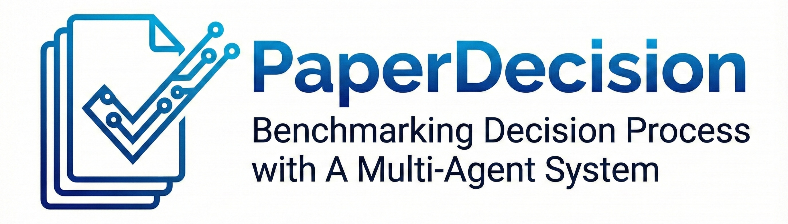
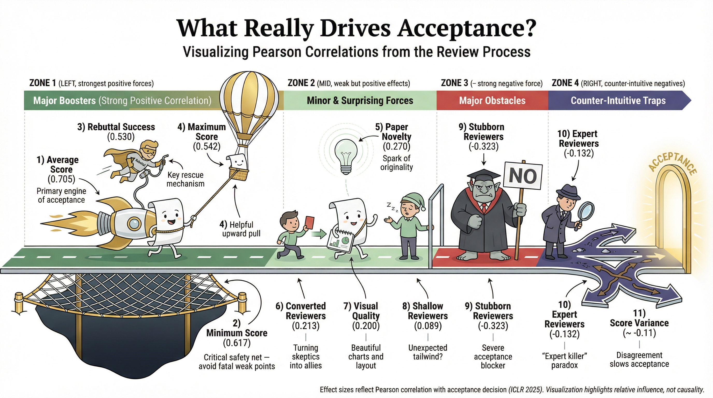

# ICLR 2026 Acceptance Prediction: Benchmarking Decision Process with A Multi-Agent System

<font size=3><div align='center' > [[🍎 Project Page](https://video-mme.github.io/)] [[🎯 ICLR 2026 Prediction](https://huggingface.co/datasets/simon123905/ICLR/blob/main/ICLR_2026_Prediction.zip)] [[🤗 Dataset](https://huggingface.co/datasets/simon123905/ICLR/tree/main)] </div></font>

<p align="center">
    
</p>

## 🔥 News
* **`2026.01.19`** 🌟 We’ve released ICLR 2026 predictions powered by the PaperDecision framework—check them out now!

## 👀 PaperDecision Overview
Academic peer review is central to research publishing, yet it remains difficult to model due to its subjectivity, dynamics, and multi-stage decision process. We introduce <strong>PaperDecision</strong>, an end-to-end framework for modeling and evaluating the peer review process with large language models (LLMs).

Our work distinguishes itself through the following key contributions:

* *An agent-based review system.* We develop <strong>PaperDecision-Agent</strong>, a multi-agent framework that simulates authors, reviewers, and area chairs, enabling holistic and interpretable modeling of review dynamics.

* *A dynamic benchmark.* We construct <strong>PaperDecision-Bench</strong>, a large-scale multimodal benchmark that links papers, reviews, rebuttals, and final decisions, and is continuously updated with newly released conference rounds to support forward-looking evaluation and avoid data leakage. 

* *Empirical insights.* We achieve up to <strong>~82% accuracy</strong> in accept–reject prediction with frontier multimodal LLMs and identify key factors influencing acceptance outcomes, such as reviewer expertise and score changes.

<p align="center">
    
</p>

## 🤖 PaperDecision-Agent
<strong>PaperDecision-Agent</strong> models key roles in the real-world peer review process through specialized agents. It simulates structured interactions among authors, reviewers, and area chairs to capture the full decision-making workflow.

<p align="center">
    
</p>

## 📊 PaperDecision-Bench
<strong>PaperDecision-Bench</strong> is a dynamic and continually extending evaluation framework explicitly aligned with the evolving ICLR peer review process, rather than a static dataset. By grounding evaluation in future decision prediction and cross-year extension, the benchmark is inherently resistant to benchmark-specific overfitting and better reflects real-world conference usage scenarios.

To balance accessibility and realism, PaperDecision-Bench adopts a three-tier evaluation design:

* [<strong>B1: Future Prediction.</strong>](https://huggingface.co/datasets/simon123905/ICLR/tree/main/ICLR_2026_Metainfo)
Targets ICLR 2026 decision prediction, where models observe papers and reviews while final outcomes remain hidden, serving as a gold-standard test of cross-temporal generalization.

* [<strong>B2: Retrospective.</strong>](https://huggingface.co/datasets/simon123905/ICLR/tree/main/ICLR_2023-2025)
Covers complete ICLR 2023–2025 data for robust retrospective evaluation, enabling reliable model comparison and systematic error analysis.

* [<strong>B3: MiniSet-1K.</strong>](https://huggingface.co/datasets/simon123905/ICLR/tree/main/Miniset-1K)
Provides a cost-efficient benchmark focusing on MLLM, 3D, and RL papers with ambiguous decision boundaries, supporting rapid iteration and analysis.

All data in PaperDecision-Bench are sourced from [OpenReview](https://openreview.net/), and the benchmark will be continuously updated as new conference rounds are released.

<p align="center">
    
</p>

## :black_nib: Citation

If you find our work helpful for your research, please consider citing our work.   

```bibtex
@misc{ICLRBench2026,
  author       = {ICLRBench Contributors},
  title        = {ICLR 2026 Acceptance Prediction: Benchmarking Decision Process with a Multi-Agent System},
  howpublished = {\url{https://github.com/ICLRBench/ICLRBench}},
  year         = {2026},
  note         = {Accessed: 2026-01-18}
}

```
